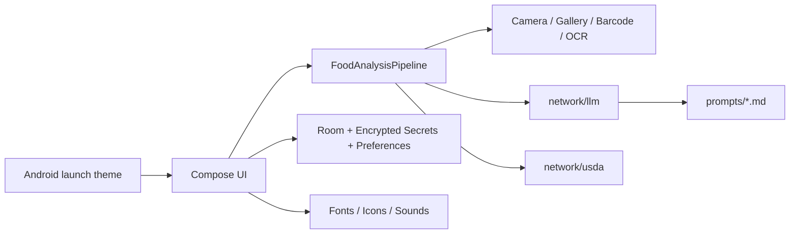
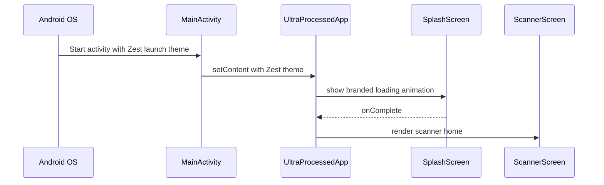
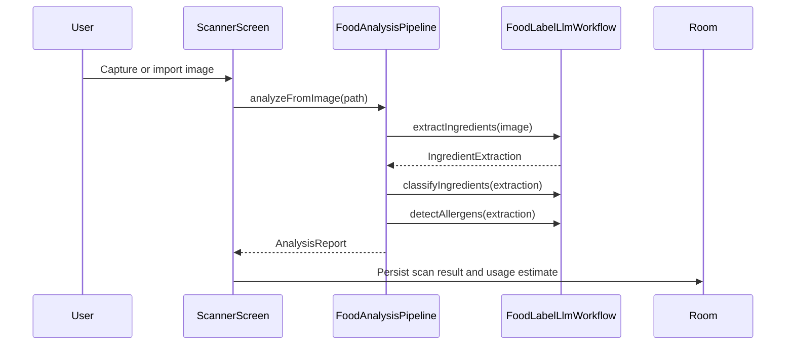
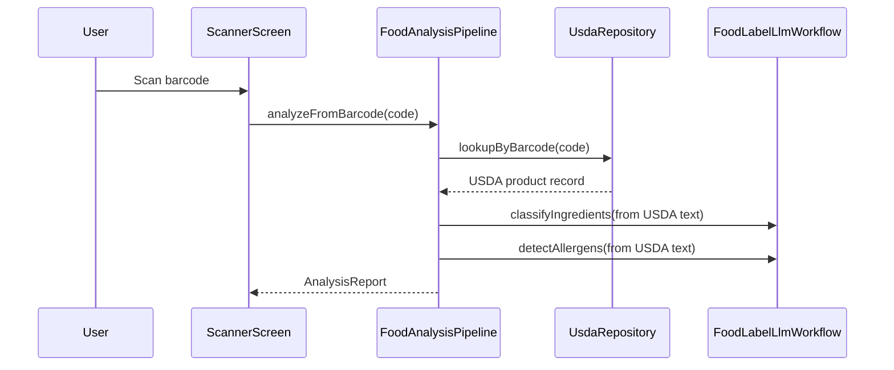
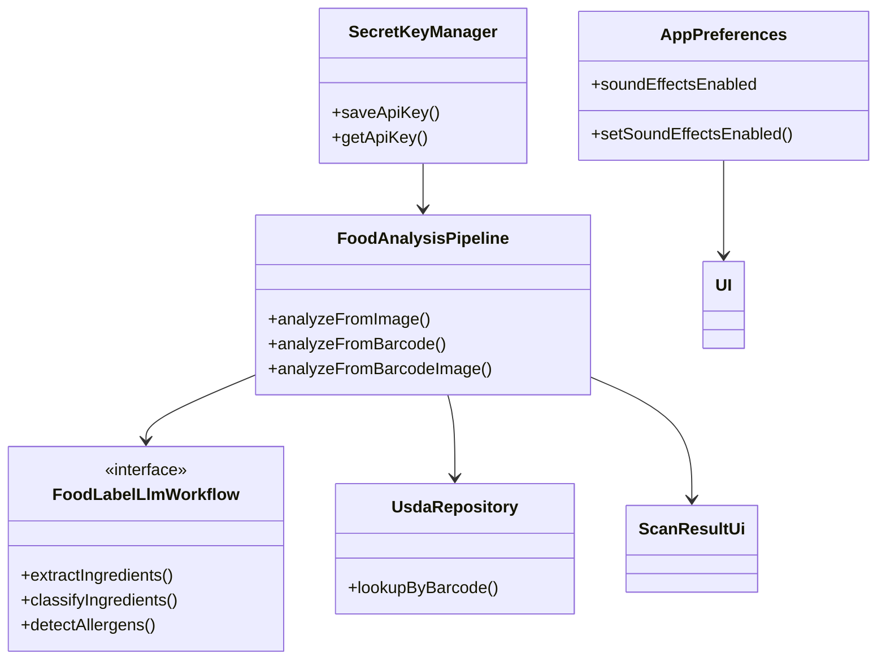

# Architecture

Zest is a native Android app for label analysis. It launches through a branded Android splash and Compose splash, captures a food label image or barcode, sends ingredient evidence through staged API workflows for NOVA classification and allergen detection, and stores the final result locally for history and review.

## Design Goals

- Keep classification and allergen logic API-driven.
- Keep secret storage encrypted and out of source control.
- Keep the UI deterministic and driven by explicit contracts.
- Keep history local, deletable, and exportable by future work.
- Keep the pipeline modular so on-device OCR can feed the same API contracts later.
- Keep brand, typography, sounds, and app chrome shared so screens stay visually consistent.
- Keep build guards in front of KSP and release tasks so retired or dataless source files cannot silently ship.

## Runtime Layers



## Startup Architecture



The native splash and launcher icon live in Android resources. The animated loading screen lives in Compose, so it can use app typography, logo composition, footer copy, sound timing, and animation state.

## Main User Flows

### Label Image



### Barcode



## Component Boundaries

- `ui/` owns Compose state, screen transitions, and display logic.
- `ui/theme/` owns Material theme, colors, Inter, and Space Grotesk.
- `ui/audio/` owns app sound playback and sound event mapping.
- `analysis/` owns orchestration, stage timing, and failure policy.
- `network/llm/` owns provider requests, retry repair, parsing, and prompt assets.
- `network/usda/` owns FoodData Central lookup, retry handling, and exact-hit ranking.
- `storage/room/` owns scan persistence.
- `storage/secrets/` owns encrypted API key storage.
- `storage/preferences/` owns non-secret local preferences such as the sound toggle.
- `res/` owns fonts, raw sounds, launcher icon resources, splash drawables, colors, strings, and themes.

## Key Contracts

### Analysis Report

```text
AnalysisReport
├── sourceType
├── productName
├── ingredientsTextUsed
├── warnings
└── scanResult: ScanResultUi
```

### Result UI Model

```text
ScanResultUi
├── productName
├── novaGroup
├── summary
├── problemIngredients
├── allIngredients
├── allergens
├── ingredientAssessments
├── rawIngredientText
├── labelImagePath
└── usageEstimate
```

### App Shell State

```text
UltraProcessedApp
├── destination
├── current scan mode
├── current scan result
├── encrypted key presence flags
├── selected model id
├── sound preference state
├── Room history flow
└── Result chat workflow
```

## Production Rules



- Do not use rules-based NOVA classification in runtime code.
- Do not treat allergens as a signal inside ingredient coloring.
- Do not infer ingredients from product name or package art.
- Do not persist plaintext keys or secret values in Compose state.
- Do not create one-off typography or brand marks in individual screens.
- Do not keep demo or legacy classifier files in `app/src`.

## Failure Policy

- Invalid image at extraction returns `code = -1` and stops.
- API rate limit errors surface as 429-specific UI messages.
- USDA lookup miss falls back to image analysis only when an image exists.
- If the LLM workflow is unavailable, the analysis fails rather than inventing a result.

## Build-Time Protection

`app/build.gradle.kts` defines source-tree verification tasks that run before normal Android build work:

- `verifyNoRetiredSourceFiles` fails if retired demo, legacy, or rule-based classifier files reappear.
- `verifyNoDatalessSources` fails on macOS dataless placeholders under `app/src`.
- `verifySourceTreeForBuild` runs both checks and is attached to `preBuild`.

These checks exist because stale source files and dataless placeholders can create testing, KSP, and deployment failures that are hard to diagnose after the build has already started.
