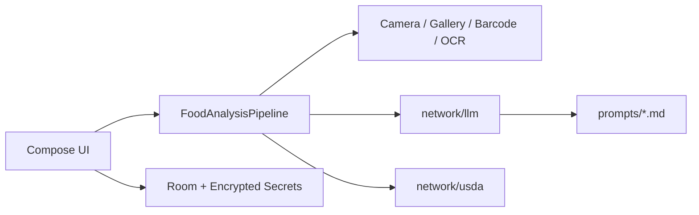
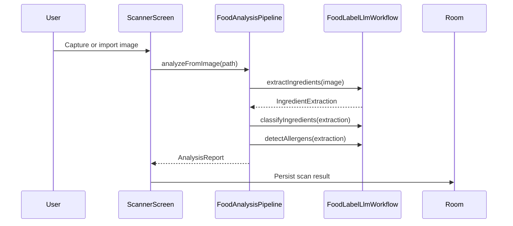
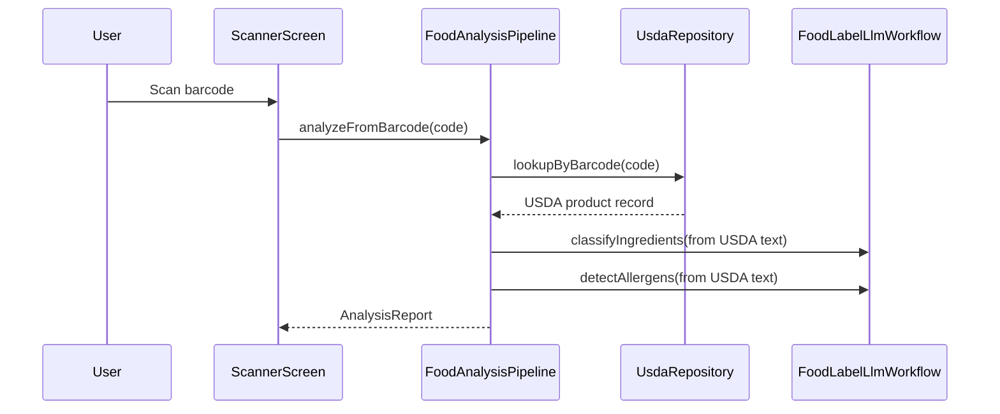
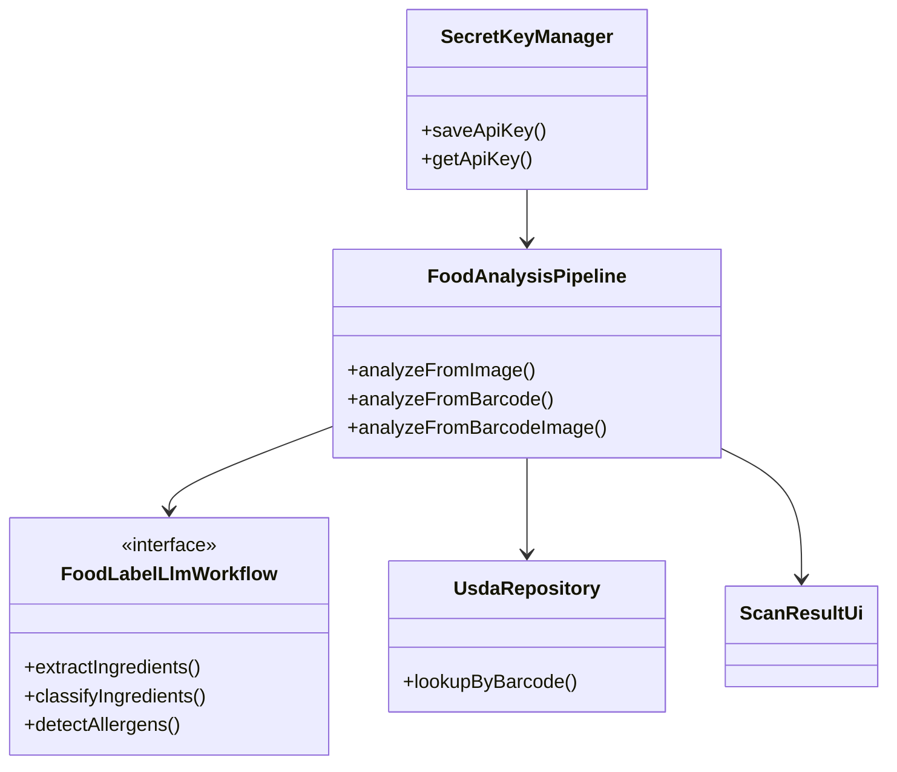

# Architecture

Zest is a native Android app for label analysis. It captures a food label image, extracts ingredient text, sends that text to staged API workflows for NOVA classification and allergen detection, and stores the final result locally for history and review.

## Design Goals

- Keep classification and allergen logic API-driven.
- Keep secret storage encrypted and out of source control.
- Keep the UI deterministic and driven by explicit contracts.
- Keep history local, deletable, and exportable by future work.
- Keep the pipeline modular so on-device OCR can feed the same API contracts later.

## Runtime Layers



## Main User Flows

### Label Image



### Barcode



## Component Boundaries

- `ui/` owns Compose state, screen transitions, and display logic.
- `analysis/` owns orchestration, stage timing, and failure policy.
- `network/llm/` owns provider requests, retry repair, parsing, and prompt assets.
- `network/usda/` owns FoodData Central lookup, retry handling, and exact-hit ranking.
- `storage/room/` owns scan persistence.
- `storage/secrets/` owns encrypted API key storage.

## Key Contracts

### Analysis Report

```text
AnalysisReport
├── sourceType
├── productName
├── ingredientsTextUsed
├── warnings
└── scanResult: ScanResultUi
```

### Result UI Model

```text
ScanResultUi
├── productName
├── novaGroup
├── summary
├── problemIngredients
├── allIngredients
├── allergens
├── ingredientAssessments
├── rawIngredientText
├── labelImagePath
└── usageEstimate
```

## Production Rules



- Do not use rules-based NOVA classification in runtime code.
- Do not treat allergens as a signal inside ingredient coloring.
- Do not infer ingredients from product name or package art.
- Do not persist plaintext keys or secret values in Compose state.

## Failure Policy

- Invalid image at extraction returns `code = -1` and stops.
- API rate limit errors surface as 429-specific UI messages.
- USDA lookup miss falls back to image analysis only when an image exists.
- If the LLM workflow is unavailable, the analysis fails rather than inventing a result.
