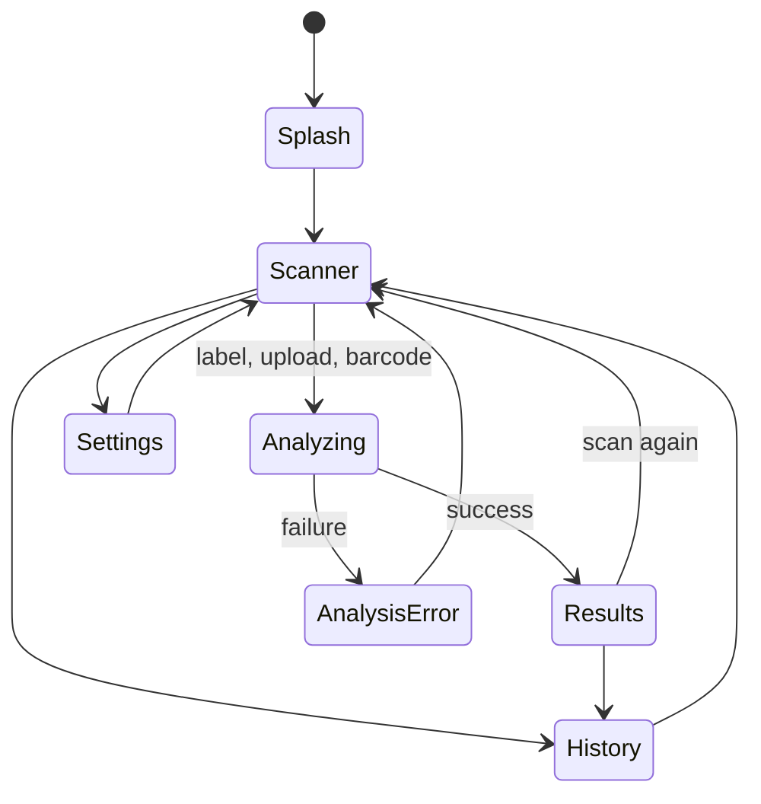
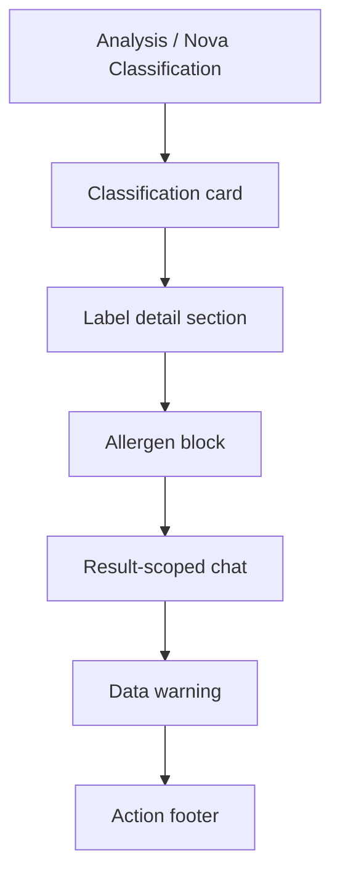

# UI And Navigation

The UI is implemented with Jetpack Compose and a small internal destination enum instead of a navigation framework. This keeps the current app shell simple while the product has a linear scanner-oriented flow.

The result page is intentionally dense and compact:

- Top heading: `Analysis`
- Top subtitle: `Nova Classification`
- Classification card shows the NOVA label.
- Ingredient chips are compact, atomic, and color-coded from API output.
- Allergens stay in their own block.
- Data warnings render at the bottom.

## Main Files

- `ui/MainActivity.kt` - Android entry point.
- `ui/UltraProcessedApp.kt` - app shell, destination state, history persistence wiring, key presence state.
- `ui/ScannerScreen.kt` - camera, barcode, and gallery upload entry points.
- `ui/AnalyzingScreen.kt` - launches analysis and renders progress.
- `ui/ResultsScreen.kt` - displays classification outcome.
- `ui/SettingsScreen.kt` - encrypted API key entry and model selection.
- `ui/HistoryScreen.kt` - local scan history.

## Destination Model

## State Ownership

`UltraProcessedApp` owns:

- Current destination.
- Last captured image path.
- Current barcode value.
- Current analysis mode.
- Current analysis result.
- Encrypted key presence flags.
- Room-backed scan history.

`ScannerScreen` owns short-lived camera UI state:

- Permission state.
- Camera readiness state.
- Barcode scanner readiness state.
- Capture/import in-flight state.
- Local status messages.

`SettingsScreen` owns only temporary text input state. Saved secrets are never loaded back into the text field.

## UI Security Rules

- Do not pass saved API key strings through Compose state.
- Do not use `rememberSaveable` for secret values.
- Show only key presence: "Key stored" or "No key stored".
- Clear typed key input after save/delete.

## Result Screen Contract

## Screen Ownership Summary

- `ResultsScreen` owns layout and display only.
- `UltraProcessedApp` owns result-scoped chat wiring and history persistence.
- `AnalyzingScreen` owns progress and retry-status messaging.
- `SettingsScreen` owns API key validation and metadata display.

## Test Mode

`enableLiveCamera = false` is used by tests so Compose UI can be exercised without camera hardware. This is a test harness path, not a production scanner path.
