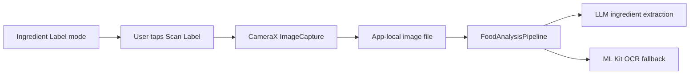
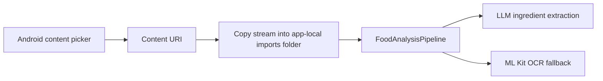
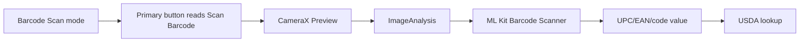

# Camera, OCR, And Barcode

This component owns product input capture. It turns physical product labels or barcodes into local image paths or barcode values for downstream analysis. OCR remains available as a fallback path, but the default label path sends the captured image into the staged LLM workflow when the user has saved an LLM key.

## Files

- `camera/CameraCaptureController.kt`
- `camera/LocalImageImportController.kt`
- `ocr/MlKitOcrPipeline.kt`
- `ocr/OcrPipeline.kt`
- `ocr/OcrResult.kt`
- `barcode/BarcodeLiveScanController.kt`
- `barcode/MlKitBarcodeScanner.kt`
- `barcode/BarcodeScanner.kt`
- `barcode/BarcodeResult.kt`

## Label Capture Flow

## Gallery Import Flow

## Barcode Flow

## Scanner UI Rules

- The camera preview is the content surface; scan brackets are an overlay with padding, not a border around the image.
- The scan line and brackets should feel related: subtle green, similar opacity, and restrained thickness.
- Upload and scan mode pills use the shared 8pt spacing system and shared typography.
- Barcode mode changes the main CTA text to `Scan Barcode`.
- Ingredient mode changes the main CTA text to `Scan Label`.

## Implementation Notes

- Camera capture uses `CAPTURE_MODE_MINIMIZE_LATENCY`.
- Barcode live scanning uses `ImageAnalysis.STRATEGY_KEEP_ONLY_LATEST` to prevent analyzer backlog.
- Barcode delivery is guarded so the same visible barcode does not trigger repeated navigation.
- Imported images are copied into app-local external files before analysis.
- OCR uses ML Kit Text Recognition with Latin options.
- OCR is intentionally behind the `OcrPipeline` interface so future on-device OCR can feed the same classification/allergen stages.
- Test mode can disable live camera preview so UI tests do not require camera hardware.

## Failure Behavior

- Missing image file returns a typed OCR/barcode failure.
- Empty OCR text returns a user-friendly failure.
- Barcode miss can fall back to image analysis when an image path is available.
