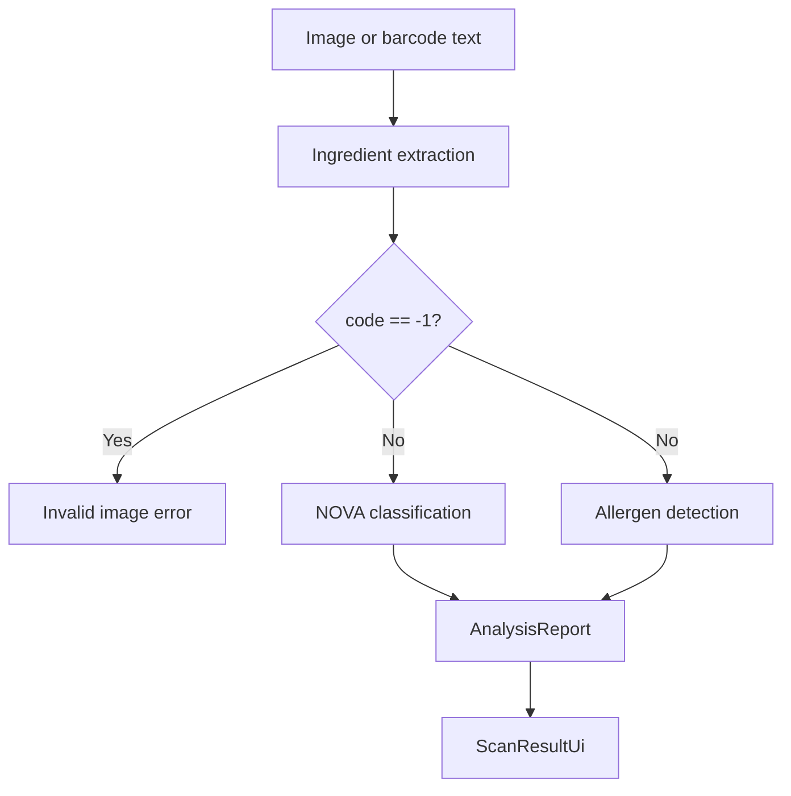
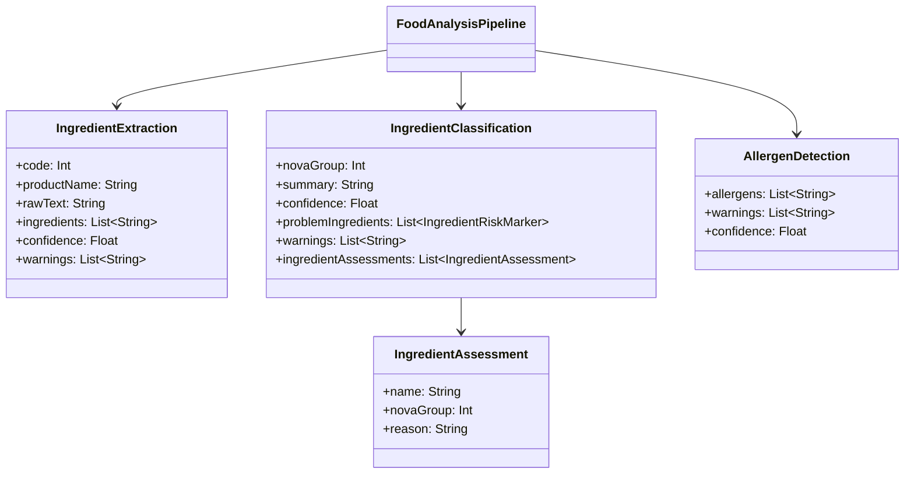

# Classification And Analysis

This layer turns extracted ingredient evidence into the final result model shown by the UI. It is staged, contract-driven, and API-only for classification and allergen detection.

## Files

- `analysis/FoodAnalysisPipeline.kt`
- `analysis/AnalysisReport.kt`
- `analysis/AnalysisStage.kt`
- `network/llm/FoodLabelLlmWorkflow.kt`
- `network/llm/GeminiFoodLabelLlmWorkflow.kt`
- `network/llm/OpenAiCompatibleFoodLabelLlmWorkflow.kt`
- `network/llm/LlmContractRetry.kt`
- `assets/prompts/food_label_ingredient_extraction_prompt.md`
- `assets/prompts/food_label_classification_prompt.md`
- `assets/prompts/food_label_allergen_prompt.md`
- `ui/ClassificationUiMapper.kt`

## Pipeline Overview



## Stage Contracts

### Extraction

- Input: image path.
- Output: `IngredientExtraction`.
- Purpose: validate that the image is a real ingredient panel and produce atomic ingredient items.
- Failure: `code = -1` stops the pipeline.

### Classification

- Input: `IngredientExtraction`.
- Output: `IngredientClassification`.
- Purpose: classify the whole label and each atomic ingredient by NOVA group.
- No image access.
- No brand or marketing inference.
- No allergen logic.

### Allergen Detection

- Input: `IngredientExtraction`.
- Output: `AllergenDetection`.
- Purpose: identify allergen signals from the same extracted ingredient evidence.
- Separate UI surface from ingredient NOVA bubbles.

## JSON Outputs

### Extraction

```json
{
  "code": 0,
  "productName": "Scanned food label",
  "rawIngredientText": "Ingredients: sugar, wheat flour, milk",
  "ingredients": ["Sugar", "Wheat Flour", "Milk"],
  "confidence": 0.91,
  "warnings": []
}
```

### Classification

```json
{
  "novaGroup": 4,
  "summary": "The list contains industrial formulation markers.",
  "confidence": 0.84,
  "ingredientAssessments": [
    { "name": "Sugar", "novaGroup": 3, "reason": "Simple ingredient." },
    { "name": "Wheat Flour", "novaGroup": 3, "reason": "Processed flour component." },
    { "name": "Artificial Flavor", "novaGroup": 4, "reason": "Strong NOVA 4 marker." }
  ],
  "problemIngredients": [
    { "name": "Artificial Flavor", "reason": "Industrial flavor marker." }
  ],
  "warnings": []
}
```

### Allergen Detection

```json
{
  "allergens": ["Milk", "Wheat"],
  "warnings": [],
  "confidence": 0.87
}
```

## Ingredient Bubble Contract

- Each `ingredients` entry must be atomic and short.
- Do not return comma blobs or sentence-like strings.
- Keep ingredient order stable.
- The UI renders each ingredient as a compact chip.
- `ingredientAssessments[n].novaGroup` maps directly to bubble color.

## Contract Enforcement



## Retry Model

- Each LLM call uses up to 3 contract attempts.
- Retry prompts include the previous schema error.
- Retry delays increase between attempts.
- UI status text surfaces the retry timing instead of hiding it.

## Result Mapping

`ClassificationUiMapper` converts analysis output into `ScanResultUi`:

- `novaGroup` becomes the top-level classification card.
- `ingredientAssessments` becomes the ingredient chip list.
- `allergens` becomes a separate allergen block.
- `warnings` becomes the data warning block at the bottom.

## Operational Notes

- OCR text may be noisy; the prompt and parser treat it as evidence, not truth.
- If extraction says invalid image, the entire flow stops.
- If classification or allergen detection fails, the analysis fails for that scan.
- There is no rule-based fallback classifier in the runtime path.
