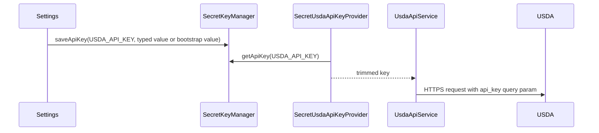
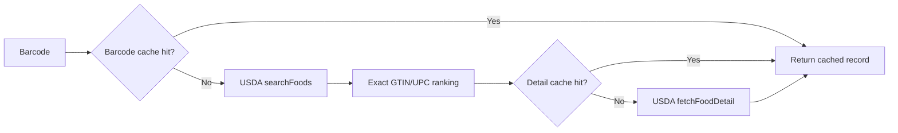
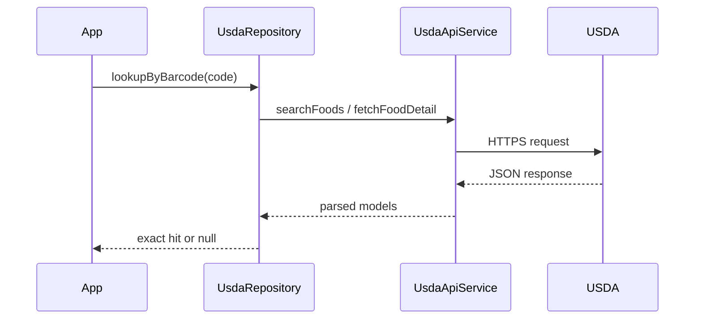

# USDA Networking

USDA lookup is optional and user-key backed. The app does not require USDA keys to be compiled through Gradle or `BuildConfig`, although a base64 bootstrap key can be provided through local developer properties for setup convenience.

The USDA path is a lookup dependency, not a classifier. It only enriches barcode scans with product ingredients and brand metadata.

The scanner still requires the LLM workflow to classify the ingredient evidence returned by USDA. USDA does not produce NOVA results or allergen verdicts.

## Files

- `network/usda/UsdaApiKeyProvider.kt`
- `network/usda/UsdaApiService.kt`
- `network/usda/UsdaRepository.kt`
- `network/usda/UsdaJsonParser.kt`
- `network/usda/UsdaModels.kt`
- `network/usda/UsdaApiDataSource.kt`

## Key Flow



## Network Policy

`UsdaHttpClientFactory` configures a bounded OkHttp client:

- Connect timeout: 3 seconds.
- Read timeout: 5 seconds.
- Write timeout: 5 seconds.
- Overall call timeout: 8 seconds.
- Connection retry enabled.
- No disk HTTP cache for authenticated USDA requests, so API keys are not persisted in cache metadata.
- USDA still requires `api_key` in the request URL. The app avoids caching and logging, but the key must still be treated as sensitive.

`UsdaApiService` also retries retryable failures once:

- HTTP 408
- HTTP 429
- HTTP 5xx
- `IOException`

The service does not retry authentication or permission failures.

## Failure Contract

```text
USDA lookup
├── success -> ingredient text and brand metadata
├── miss -> null
├── retryable -> 408 / 429 / 5xx / IOException
└── fatal -> 401 / 403 / malformed response
```

## Repository Cache

`UsdaRepository` keeps an in-memory cache for repeated lookups:

- Barcode lookup cache.
- Query lookup cache.
- Food detail cache.
- Default TTL: 1 hour.
- Max entries per cache: 128.



## Ranking Policy

Barcode search keeps leading zeros for USDA search but normalizes GTIN/UPC values for comparison. The repository only accepts a USDA search hit when the candidate GTIN/UPC matches the scanned code. It does not return unrelated branded search results.

## Call Sequence


