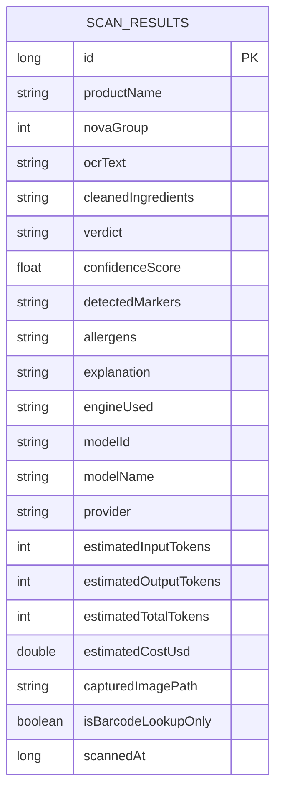
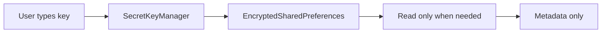

# Storage And Security

Zest keeps user data local unless the user opts into an external lookup or model provider.

The storage contract is intentionally split by sensitivity:

- secrets live in encrypted preferences,
- scan history lives in Room,
- captured images remain local files until deleted,
- provider keys are never shown back in plain text.

## Files

- `storage/secrets/SecretKeyManager.kt`
- `storage/room/NovaDatabase.kt`
- `storage/room/ScanResult.kt`
- `storage/room/ScanResultDao.kt`
- `storage/datastore/AppSettings.kt`
- `ui/UltraProcessedApp.kt`
- `ui/SettingsScreen.kt`

## Secrets

API keys are stored with Android Keystore-backed encrypted preferences:

- `LLM_API_KEY` for the staged image analysis workflow.
- `USDA_API_KEY` for FoodData Central barcode lookup.

Rules:

- Never compile API keys into the app.
- Never place API keys in `BuildConfig`.
- Never preload saved keys into Compose state.
- Save/delete methods return commit success.
- UI stores only boolean key presence.

## Room History

Room persists scan results in `scan_results`.

Stored fields include:

- Product name
- NOVA group
- OCR/ingredient text
- Raw extracted ingredient text
- Verdict
- Confidence
- Detected markers
- Allergen signals
- Explanation
- Engine used
- Captured image path
- Barcode-only flag
- Timestamp
- Usage estimate fields for tokens and cost

## Migration Policy

The database is versioned and exports schemas under `app/schemas`. Version 2 adds product and UI history fields to the original scan result table. Version 3 adds allergen storage. Migrations preserve existing rows with safe defaults and are covered by an instrumentation migration test.

## Data Boundaries

Local:

- Label captures
- Imported images
- OCR output
- Normalized ingredients
- Classification result
- Allergen result
- History rows
- API keys

Network:

- USDA barcode lookup sends barcode/product query and uses a user-provided USDA key.
- USDA requests do not use disk HTTP cache because the API key is part of the provider request URL.
- Staged LLM image analysis sends the captured label image for ingredient extraction when the user has saved an LLM key.
- LLM classification and allergen detection send extracted ingredient JSON, not the image.
- Invalid images are rejected at extraction with `code = -1`; later LLM stages and local fallback are not invoked for that user input.
- If no LLM key is saved, the app cannot perform analysis. All classification is dependent on the LLM provider.

## Secret Lifecycle

## Key Metadata Display

The settings screen only shows metadata inferred from the saved LLM key:

- provider
- default model name
- whether the provider accepts images

It does not display the key itself and it does not provide a USDA key input surface in the UI.
