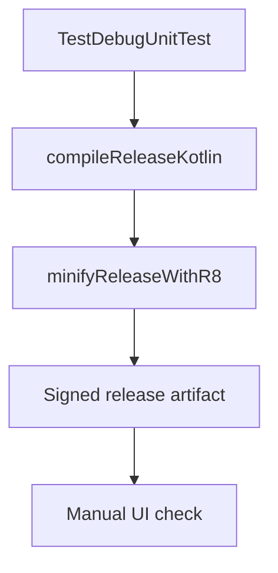

# Testing And Release

This document describes how to verify the app after changing architecture, security, networking, or UI flow.

The release bar is:

- no rule-based classification path in runtime,
- no demo/sample UI paths in production,
- API contracts enforced by tests,
- release minification passing,
- and user-facing 429 handling present in the UI.

## Unit Tests

Run:

```bash
./gradlew :app:testDebugUnitTest
```

Covered areas:

- Ingredient normalization.
- USDA JSON parsing.
- USDA repository UPC matching and cache behavior.
- Food analysis pipeline staged API workflow and invalid-image handling.
- Prompt contract parsing for extraction, classification, allergen detection, and result chat.

## Android Tests

Run from Android Studio or a connected emulator:

```bash
./gradlew :app:connectedDebugAndroidTest
```

Covered areas:

- Shared chrome rendering.
- Scanner header actions.
- Scanner startup without camera hardware in test mode.
- History and migration behavior.

## Release Build

Run:

```bash
./gradlew :app:assembleRelease
```

Release hardening:

- R8 minification enabled.
- Resource shrinking enabled.
- Optimized default Android ProGuard rules.
- Release lint vital checks.
- No API keys compiled into `BuildConfig`.
- Release versioning reads `ZEST_VERSION_CODE` and `ZEST_VERSION_NAME` Gradle properties.
- Release signing is mandatory for release artifacts and reads `ZEST_RELEASE_STORE_FILE`, `ZEST_RELEASE_STORE_PASSWORD`, `ZEST_RELEASE_KEY_ALIAS`, and `ZEST_RELEASE_KEY_PASSWORD` from the environment.
- `minifyReleaseWithR8` must succeed.
- 429 and quota failures surface a specific analysis error panel with user guidance.

## Release Contract



## Verification Checklist

- Unit tests pass.
- Release APK assembles with signing environment variables present.
- Android test APK assembles.
- `rg "BuildConfig|local.properties|USDA_API_KEY" app/src/main app/build.gradle.kts` shows no embedded key source.
- Room schema is exported under `app/schemas`.
- Room migration instrumentation test compiles.
- Settings saves API keys without showing saved values again.
- Image analysis uses the user-provided LLM key only through `SecretKeyManager`.
- Prompt assets exist for extraction, classification, and allergen detection.
- Barcode lookup fails gracefully without a USDA key.
- Scan history persists after navigating away from Results.
- Delete from History removes the Room row and locally stored scan image when the image is under app-owned storage.
- Result page shows compact ingredient bubbles without rule-based sublabels.
- Analysis screen title reads `Analysis` with `Nova Classification` as the subtitle.
