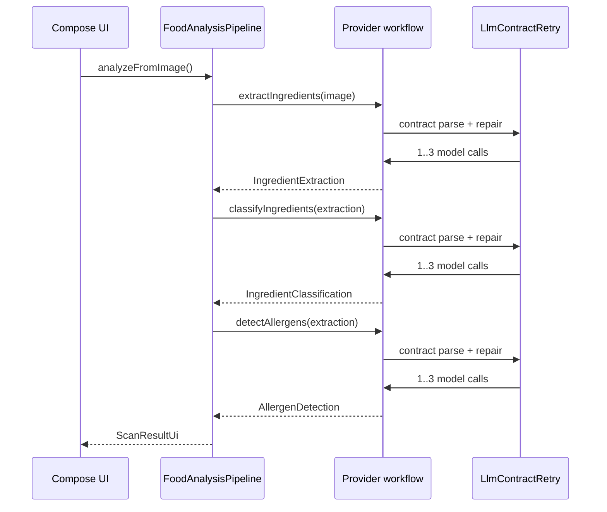
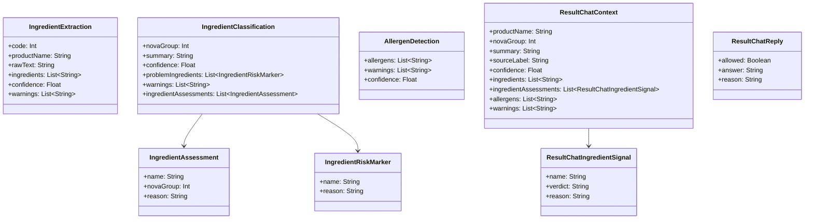

# LLM API Contracts

This document is the source of truth for every model call in Zest. It covers:

- the request flow for each LLM stage,
- the exact output classes the app expects,
- the validation/repair pass,
- and the retry behavior that keeps malformed responses out of the UI.

The runtime is API-only for analysis, classification, allergen detection, and result chat. The app does not use rule-based classification as a production fallback.

## Files

- `network/llm/FoodLabelLlmWorkflow.kt`
- `network/llm/GeminiFoodLabelLlmWorkflow.kt`
- `network/llm/OpenAiCompatibleFoodLabelLlmWorkflow.kt`
- `network/llm/ResultChatWorkflow.kt`
- `network/llm/LlmContractRetry.kt`
- `network/llm/MultiProviderFoodLabelLlmWorkflow.kt`
- `network/llm/ResultChatWorkflowFactory.kt`
- `assets/prompts/food_label_ingredient_extraction_prompt.md`
- `assets/prompts/food_label_classification_prompt.md`
- `assets/prompts/food_label_allergen_prompt.md`
- `assets/prompts/food_label_response_validation_prompt.md`
- `assets/prompts/food_label_result_chat_prompt.md`

## Call Map

| Stage | Input | Output | Notes |
| --- | --- | --- | --- |
| Ingredient extraction | image path | `IngredientExtraction` | Vision call. Detects valid ingredient panels and returns atomic ingredient items. |
| Validation pass | candidate JSON | repaired JSON | Second API call. Normalizes malformed ingredient/allergen text and repairs schema issues. |
| NOVA classification | `IngredientExtraction` | `IngredientClassification` | Text-only call. Classifies the whole label and each ingredient. |
| Allergen detection | `IngredientExtraction` | `AllergenDetection` | Text-only call. Separate from NOVA classification. |
| Result chat | `ResultChatContext` + user question | `ResultChatReply` | Scopes questions to the current scan only. Rejects injection and off-topic prompts. |

## Transport Layer

### Gemini

Gemini workflows call:

`POST https://generativelanguage.googleapis.com/v1beta/models/{modelId}:generateContent`

Headers:

- `x-goog-api-key: <api key>`

Request shape:

- `contents[0].parts[]` contains text and, for extraction, an inline image.
- `generationConfig.responseMimeType` is `application/json`.

### OpenAI-Compatible Providers

OpenAI-compatible workflows call:

`POST {baseUrl}/chat/completions`

Headers:

- `Authorization: Bearer <api key>`

Request shape:

- `messages[0].role = "user"`
- `messages[0].content` contains the prompt plus the input JSON.
- `response_format.type = "json_object"`

## Request Flow



## Expected Output Classes



## Stage Contracts

### IngredientExtraction

Purpose:
- decide whether the image contains a real ingredient panel,
- reject invalid images,
- and return short atomic ingredient items.

Required fields:
- `code`: `0` for valid ingredient images, `-1` for invalid images.
- `productName`: visible product name only when it is clearly present.
- `rawText`: best-effort transcription of the ingredient panel.
- `ingredients`: atomic ingredient tokens in reading order.
- `confidence`: 0.0 to 1.0.
- `warnings`: OCR or crop quality notes.

Important rules:
- do not infer ingredients from product name or packaging art,
- do not return long sentence-like ingredient clauses,
- do not treat `Contains:` or `May contain` strings as ingredients.

### IngredientClassification

Purpose:
- classify the whole label with a single NOVA group,
- assign a NOVA group to each ingredient bubble,
- and provide a concise reason string for each output item.

Required fields:
- `novaGroup`: 1..4
- `summary`: consumer-readable classification summary
- `confidence`: 0.0 to 1.0
- `problemIngredients`: items that most strongly pushed the label toward a higher NOVA group
- `warnings`: OCR or uncertainty notes
- `ingredientAssessments`: one object per visible ingredient

Ingredient assessment rules:
- `name` must stay close to the original ingredient wording,
- do not emit sentence fragments,
- do not replace the ingredient with a synonym or broader category,
- do not mix allergen logic into NOVA coloring.

### AllergenDetection

Purpose:
- identify explicit allergen signals only,
- keep the allergen block separate from NOVA ingredient coloring.

Required fields:
- `allergens`: standalone allergen names only
- `warnings`: OCR or ambiguity notes
- `confidence`: 0.0 to 1.0

Important rules:
- do not infer allergens from product name,
- do not infer from shared-facility claims unless the text explicitly says so,
- normalize clause-like text into atomic allergen names if possible.

### ResultChatReply

Purpose:
- answer questions about one scan result only,
- refuse injection attempts,
- and reject off-topic questions.

Required fields:
- `allowed`: boolean gate for whether the answer is permitted
- `answer`: the user-facing answer when allowed
- `reason`: why a response was denied or constrained

## Validation Pass

Every major stage can be followed by a validation/repair API call.

Input:

```json
{
  "operation": "classification",
  "candidate": {
    "...": "original model output"
  }
}
```

Behavior:

- the second model pass sees the candidate JSON,
- it repairs malformed JSON and sentence-like ingredient/allergen strings,
- it must not invent new facts,
- it may normalize output into atomic tokens,
- if the candidate is already valid, it returns a corrected equivalent object.

This validation prompt is what keeps strings like `Contains: Wheat, May Contain Milk` from reaching the UI unchanged.

## Retry Semantics

The shared retry helper in `LlmContractRetry.kt` enforces:

- up to 3 attempts per contract stage,
- increasing backoff between attempts,
- repair prompts that include the previous validation error,
- status messages that show the user what is happening.

Backoff schedule:

- attempt 1: no delay
- attempt 2: 1.2 seconds
- attempt 3: 2.4 seconds

Contract violations that trigger retries include:

- missing required fields,
- invalid JSON,
- unsupported codes or NOVA groups,
- incomplete objects,
- unusable ingredient lists,
- malformed sentence-like ingredient or allergen strings.

If all retries fail:

- the API layer throws a user-safe message,
- the UI should not display raw schema field names,
- the analysis screen should show a generic parse failure or fallback message.

## Provider Notes

### Gemini image extraction

- uses inline image data,
- only runs for supported Gemini models,
- carries the image and prompt in one request.

### OpenAI-compatible extraction

- uses `chat/completions`,
- sends the image as a data URL,
- relies on the provider supporting multimodal content.

### Result chat

- uses the current scan result as locked context,
- does not allow general conversation,
- refuses prompt injection before the model is called when possible,
- still validates the final JSON reply.

## Adding Another Provider

To add a new provider, implement:

- `FoodLabelLlmWorkflow`
- `ResultChatWorkflow`

Then ensure:

- it uses the same prompt assets,
- it participates in `MultiProviderFoodLabelLlmWorkflow`,
- it respects the 3-attempt contract retry helper,
- it returns the same output classes listed above.

## Operational Rule

If a payload cannot be parsed or validated, the user should see a clean analysis failure state or a retry/fallback message, not the raw model error text.
