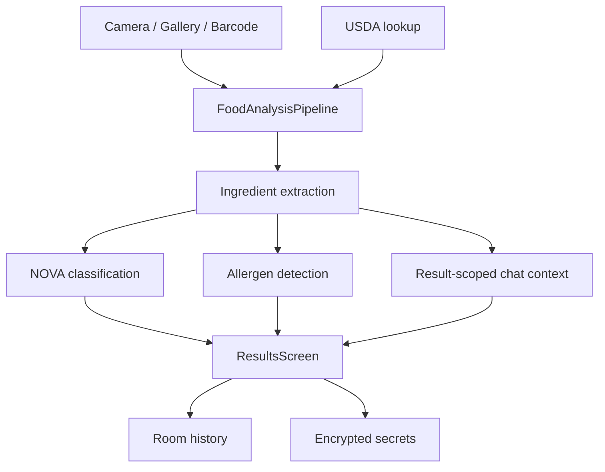

# Technical Documentation

This folder is the handoff surface for Zest. Each document explains one production area with concrete contracts, data flow, and implementation boundaries so a new engineer can work without reading the whole codebase first.

## Document Map

- [01-architecture.md](01-architecture.md) - system shape, runtime layers, and cross-cutting constraints.
- [02-ui-navigation.md](02-ui-navigation.md) - Compose shell, destination ownership, and screen responsibilities.
- [03-camera-ocr-barcode.md](03-camera-ocr-barcode.md) - capture, gallery import, OCR, and barcode routing.
- [04-classification-analysis.md](04-classification-analysis.md) - extraction, API-only NOVA classification, allergen detection, and result contracts.
- [05-usda-networking.md](05-usda-networking.md) - USDA lookup, retries, cache behavior, and failure modes.
- [06-storage-security.md](06-storage-security.md) - encrypted secrets, Room history, image retention, and privacy boundaries.
- [07-testing-release.md](07-testing-release.md) - debug tests, release verification, and hardening checklist.
- [08-llm-api-contracts.md](08-llm-api-contracts.md) - exact LLM request flow, response classes, validation pass, and retry semantics.

## Current Product Contract




## Core Output Blocks

### Extraction

```json
{
  "code": 0,
  "productName": "Scanned food label",
  "rawIngredientText": "Ingredients: sugar, wheat flour, milk",
  "ingredients": ["Sugar", "Wheat Flour", "Milk"],
  "confidence": 0.91,
  "warnings": []
}
```

### Classification

```json
{
  "novaGroup": 4,
  "summary": "The ingredient list contains strong ultra-processing markers.",
  "confidence": 0.82,
  "ingredientAssessments": [
    { "name": "Sugar", "novaGroup": 3, "reason": "Simple carbohydrate ingredient." },
    { "name": "Wheat Flour", "novaGroup": 3, "reason": "Processed flour component." },
    { "name": "Artificial Flavor", "novaGroup": 4, "reason": "Industrial flavor marker." }
  ],
  "problemIngredients": [
    { "name": "Artificial Flavor", "reason": "Strong NOVA 4 marker." }
  ],
  "warnings": []
}
```

### Allergen Detection

```json
{
  "allergens": ["Milk", "Wheat"],
  "warnings": [],
  "confidence": 0.88
}
```

## Shared Rules

- The pipeline is API-first for classification and allergen detection.
- Local OCR may still provide text input, but it is only a transport mechanism into the API contract.
- Ingredient bubbles are driven by atomic ingredient items and per-item NOVA groups.
- Allergens have a separate UI block and a separate API contract.
- Invalid images stop at extraction with `code = -1`.

## Reading Order For A New Engineer

1. Read [01-architecture.md](01-architecture.md).
2. Read [04-classification-analysis.md](04-classification-analysis.md).
3. Read [06-storage-security.md](06-storage-security.md).
4. Read [07-testing-release.md](07-testing-release.md).

## What To Avoid

- Do not add rule-based NOVA fallback paths back into the runtime.
- Do not put secret values in `BuildConfig`, Compose state, or repo text files.
- Do not merge allergens into ingredient coloring.
- Do not return long clause-like items in ingredient arrays.
