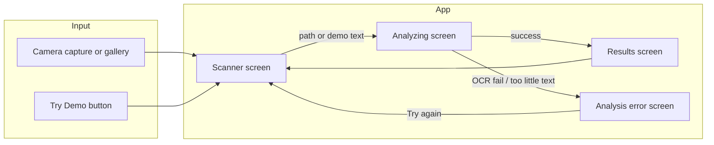
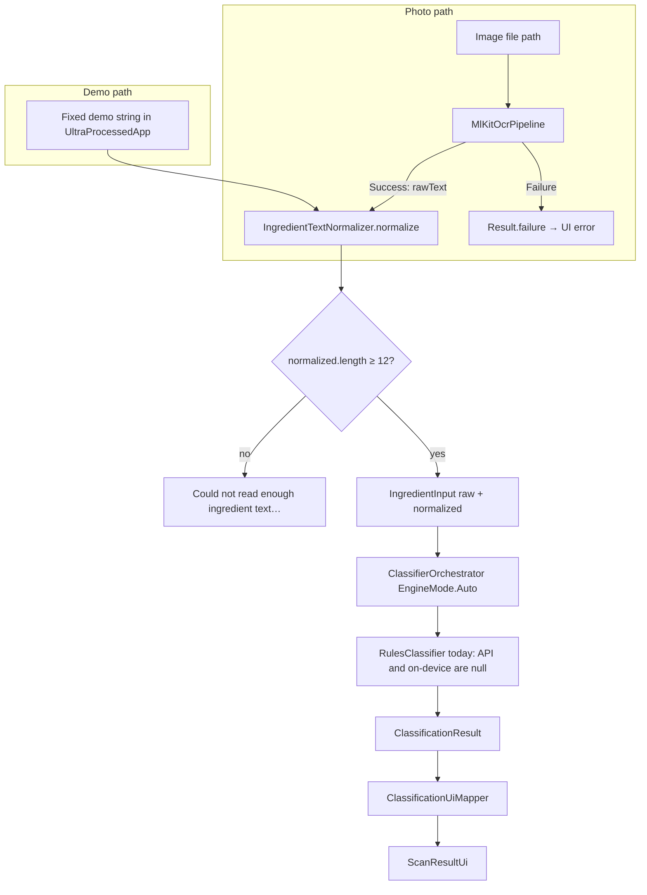
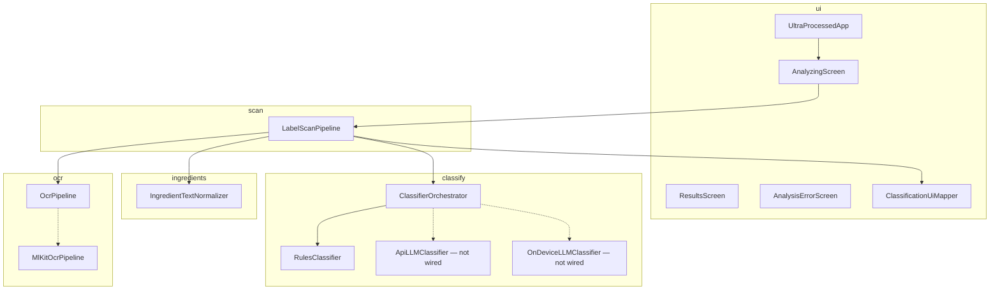
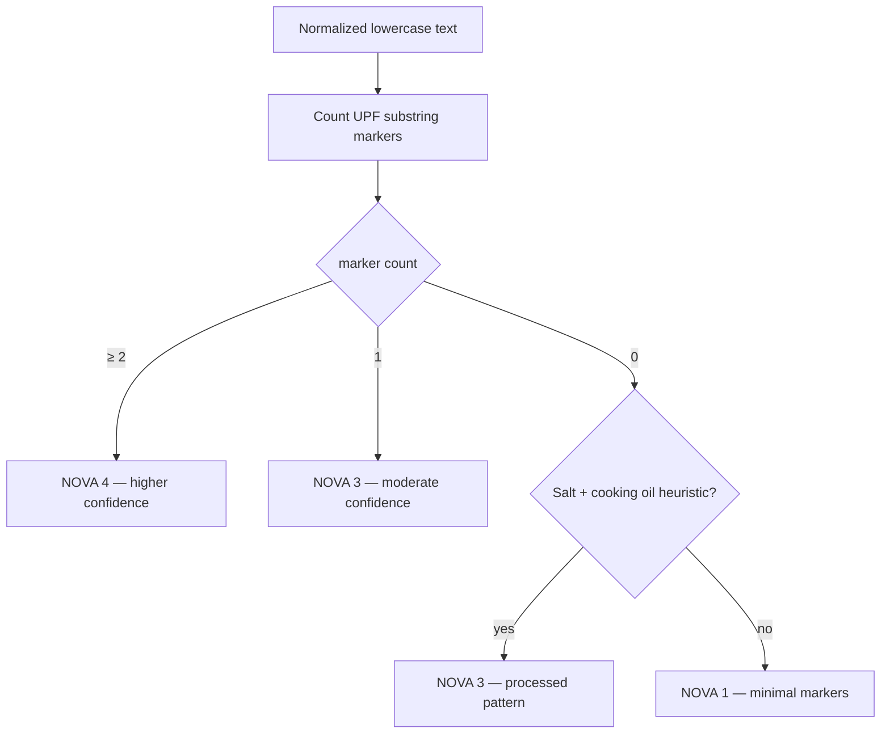
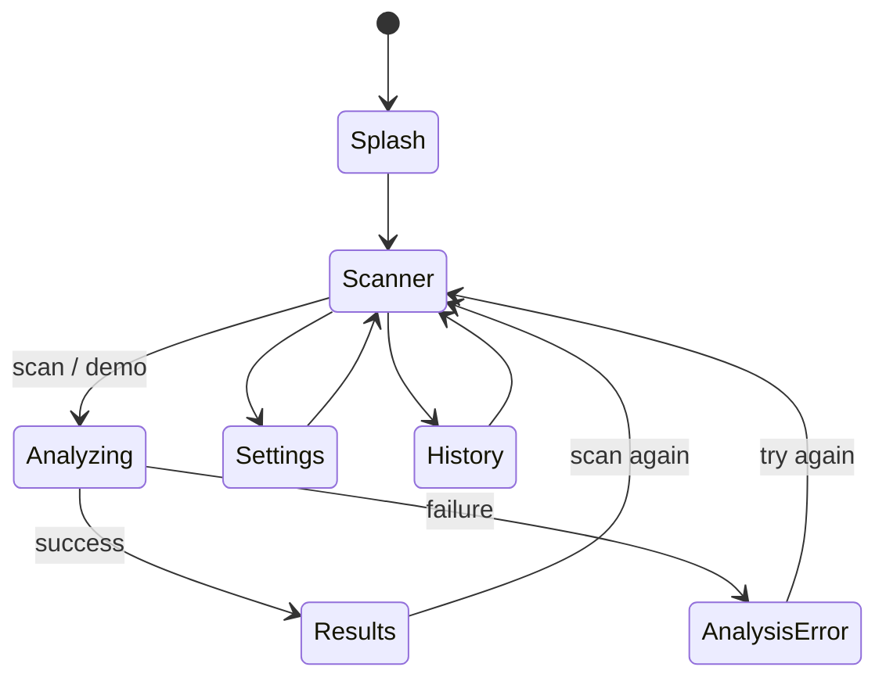

# Emre update: end-to-end label scan to NOVA-style classification

This document describes the work that connects **camera or gallery images** (and a **demo text path**) to **on-device OCR**, **ingredient normalization**, **rules-based NOVA-style classification**, and the **Compose UI**. It is meant as a handoff for contributors and reviewers.

---

## 1. Goals achieved

| Goal | Status |
|------|--------|
| Real pipeline: image → OCR → normalize → classify → UI | Done |
| Google ML Kit Text Recognition (Latin) | Done |
| Pluggable `OcrPipeline` + `MlKitOcrPipeline` | Done |
| `IngredientTextNormalizer` (prefix, whitespace, line breaks) | Done |
| `IngredientInput` → `ClassifierOrchestrator` (local-only: no network) | Done |
| Marker-based `RulesClassifier` (0 / 1 / 2+ markers + processed heuristic) | Done |
| Replace timed stub analysis with real work in `AnalyzingScreen` | Done |
| User-visible error when text is too short after OCR | Done |
| Unit tests + fixture samples for expected NOVA groups | Done |
| Gradle: ML Kit + `kotlinx-coroutines-play-services` | Done |

**Still optional / future:** `ApiLLMClassifier` + `RemoteClassifierGateway`, on-device LLM, Room/DataStore persistence for keys and history (UI copy may still mention them).

---

## 2. High-level user flow



---

## 3. Technical pipeline (data flow)

Two entry paths converge on the same classification step:



---

## 4. Layered architecture (packages)



Solid lines: used in the current local-only build. Dotted lines: interfaces or classes present for future wiring.

---

## 5. Core data schema (Kotlin models)

### 5.1 OCR

| Type | Fields / variants |
|------|-------------------|
| `OcrResult` | `Success(rawText)` or `Failure(message, cause?)` |
| `OcrPipeline` | `suspend fun recognizeText(imagePath: String): OcrResult` |

### 5.2 Classification (domain)

| Type | Purpose |
|------|---------|
| `IngredientInput` | `rawText`, `normalizedText`, optional `languageTag` |
| `ClassificationContext` | `allowNetwork`, `apiFallbackEnabled`, `preferOnDevice` |
| `ClassificationResult` | `novaGroup`, `confidence`, `markers`, `explanation`, `highlightTerms`, `engine` |
| `Classifier` | Implementations: `RulesClassifier`, future API / on-device |

### 5.3 UI

| Type | Purpose |
|------|---------|
| `ScanResultUi` | Includes `confidence` and `engineLabel` for the results card |
| `AppDestination` | Added `AnalysisError` for failed analysis |

---

## 6. RulesClassifier decision logic (summary)



UPF markers include (among others): maltodextrin, natural/artificial flavor, flavoring, emulsifier, stabilizer, color added, modified starch, hydrogenated oil, HFCS, MSG, sodium benzoate, carrageenan, sweeteners, polysorbate, protein isolates, etc. The **salt + oil** branch covers lists like “corn, salt, sunflower oil” without additive keywords.

---

## 7. Screen navigation (app state)



`UltraProcessedApp` holds:

- `scanSessionId` (re-triggers `LaunchedEffect` on `AnalyzingScreen`)
- `lastCapturedPhotoPath`, `demoIngredientText` (mutually exclusive for a given run)
- `currentScanResult` for `ResultsScreen`
- `analysisErrorMessage` for `AnalysisErrorScreen`
- in-memory `historyItems` (still not Room-backed)

---

## 8. File map (where things live)

| Path | Role |
|------|------|
| `app/.../ocr/OcrResult.kt` | OCR outcome sealed class |
| `app/.../ocr/OcrPipeline.kt` | OCR interface |
| `app/.../ocr/MlKitOcrPipeline.kt` | ML Kit implementation |
| `app/.../ingredients/IngredientTextNormalizer.kt` | Text cleanup |
| `app/.../scan/LabelScanPipeline.kt` | Orchestrates OCR + normalize + orchestrator + mapper |
| `app/.../ui/ClassificationUiMapper.kt` | `ClassificationResult` → `ScanResultUi` |
| `app/.../ui/AnalysisErrorScreen.kt` | Error UX |
| `app/.../ui/UltraProcessedApp.kt` | Wires navigation and callbacks |
| `app/.../ui/AnalyzingScreen.kt` | Runs pipeline in `LaunchedEffect` |
| `app/.../ui/AppModels.kt` | `ScanResultUi`, destinations, stubs |
| `app/.../classify/RulesClassifier.kt` | Marker scoring + explanations |
| `app/.../classify/ClassifierOrchestrator.kt` | Unchanged contract; used with `null` API/on-device |
| `app/build.gradle.kts` | ML Kit + coroutines Play Services |
| `app/src/test/.../NovaIngredientSampleFixturesTest.kt` | Four canonical ingredient strings |
| `app/src/test/.../IngredientTextNormalizerTest.kt` | Normalizer tests |
| `app/src/test/.../RulesClassifierTest.kt` | Rules + heuristic tests |

---

## 9. Dependencies added

```text
com.google.mlkit:text-recognition:16.0.1
org.jetbrains.kotlinx:kotlinx-coroutines-play-services:1.9.0
```

OCR uses `InputImage.fromFilePath(context, Uri.fromFile(file))` because the ML Kit API expects a `Uri`.

---

## 10. How to verify quickly

1. **Unit tests:** `./gradlew :app:testDebugUnitTest`
2. **App:** Run on device/emulator → **Try Demo** → expect a real **NOVA 1**-style result for oats/dates/almonds.
3. **Camera/gallery:** Capture a label with readable English ingredients → results should reflect rules + OCR quality.

---

## 11. Related project docs

- `README.md` — contributor runbook (some stack lines still mention Room/OkHttp as planned; this update completes the OCR → rules path only).
- `change.md` — day-to-day change log; you can add a short pointer to this file after merges if you want traceability.

---

*Document version: aligned with the end-to-end OCR + rules classification integration.*
